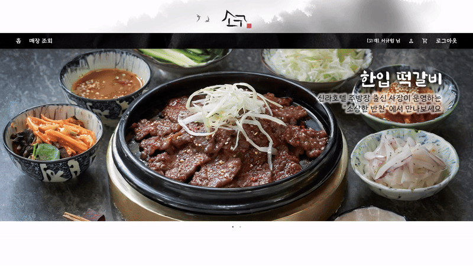
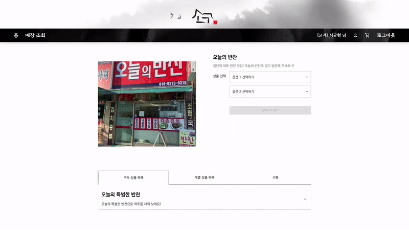
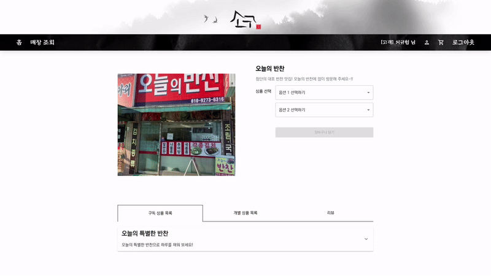
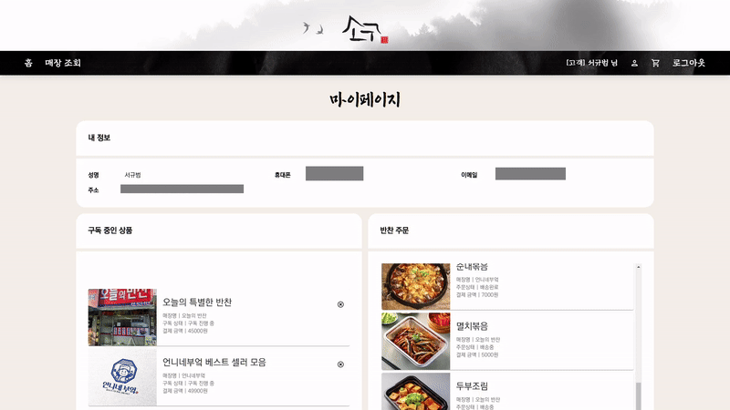
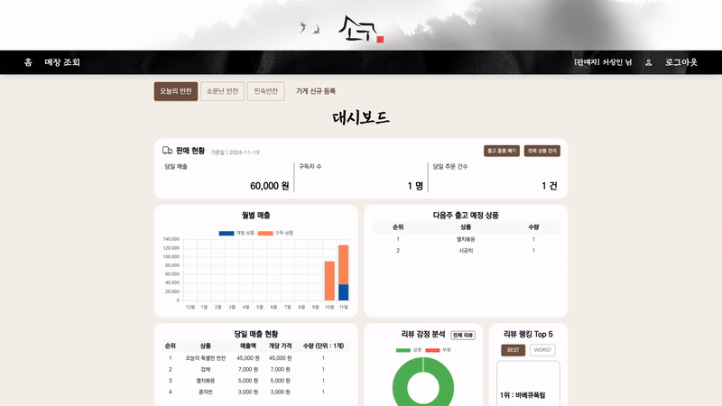

# 🍱 소상한 구독 (SOGOO)

## 🍴 프로젝트 소개

소상공인들은 대부분 불안정한 매출로 인해 사업 운영에 어려움을 겪고 있습니다.

특히 코로나19 이후 경기 침체와 물가 상승으로 인해 고정 고객 확보가 더욱 어려워졌고, 이는 소상공인들의 수익 예측을 더욱 힘들게 만들고 있습니다.

하지만 현재 소상공인을 위한 구독 서비스 플랫폼이 부재하여, 안정적인 수익을 원하는 소상공인과 신뢰할 수 있는 지역 상품을 정기적으로 이용하고 싶은 소비자들의 수요가 제대로 연결되지 못하고 있습니다.

이에 소상공인의 안정적인 수익 창출과 소비자의 믿을 수 있는 구독 경험을 위해 이 서비스를 기획하게 되었습니다.

> "소상공인의 안정적인 수익 창출과 소비자의 신뢰할 수 있는 구독 경험을 연결하는 플랫폼"

- 소상공인을 위한 맞춤형 구독 상품 설계 및 관리
- 구독자 관리 및 매출 분석 대시보드
- 소비자 리뷰 기반의 상품 만족도 분석 차트
- 소비자 정보 기반 매장 추천 및 검색 시스템

[배포 링크 (https://www.sogoo.kr/) 🔗](https://www.sogoo.kr/)

## 🍴 프로젝트 기간

24.10.14 ~ 24.11.19 (6주)

(SSAFY 자율 프로젝트 - 자유 주제)

## 🍴 기술 스택

### **Backend**

 
 
 
 
 
 

### **Frontend**

 
 
 

 

### **CI/CD**

 
 
 
 
 

### **Communication**

 
 
 
 

## 🍴 팀원 소개

|  |  |  |  |  |  |
| ------------------------------------------------------- | --------------------------------------------------------- | ------------------------------------------------------------ | ----------------------------------------------------------- | ----------------------------------------------------------- | ---------------------------------------------------------- |
| 남혁준([@zzun73](https://github.com/zzun73))            | 박동민([@PDMsnail](https://github.com/PDMsnail))          | 서규범([@goosebbeoms](https://github.com/goosebbeoms))       | 이학현([@hyeonhakyi](https://github.com/hyeonhakyi))        | 최승현([@cshyun7097](https://github.com/cshyun7097))        | 황민채([@trick0846](https://github.com/trick0846))         |
| Leader / Backend                                        | Frontend                                                  | Fullstack                                                    | Backend                                                     | Backend                                                     | Frontend                                                   |

## 🍴 프로젝트 산출물

- [기능명세서](./docs/기능명세서.md)
- [API명세서](./docs/API명세서.md)
- [ERD](./docs/ERD.md)
- [목업](./docs/목업.md)
- [아키텍처](./docs/아키텍처.md)

## 🍴 프로젝트 결과물

- [포팅매뉴얼](./exec/)
- [중간발표자료](./docs/SSAFY_11기_자율_C107_중간발표.pdf)
- [최종발표자료](./docs/SSAFY_11기_자율_C107_최종발표.pdf)

## 🍴 기능 및 화면 구성

### 랜딩페이지

### 로그인/로그아웃

### 매장 조회

### 매장 조회 - 검색

### 매장 조회 - 상세

### 구매자 - 마이페이지

### 구매자 - 매장 추천

### 구매자 - 개별 반찬 구매

### 구매자 - 구독 상품 구매

### 구매자 - 리뷰 작성

### 판매자 - 대시보드

### 판매자 - 반찬 등록

### 판매자 - 구독 상품 등록

### 판매자 - 출고 물품 빼기

